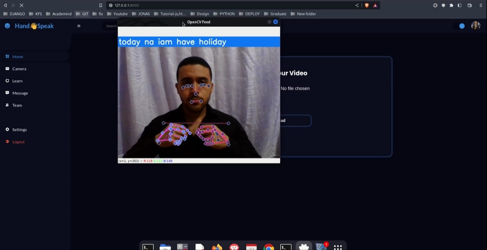
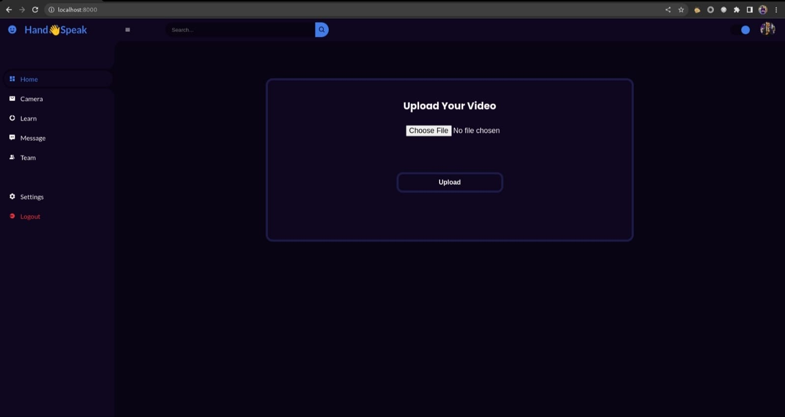

# HAND SPEAK 👋️ (graduation project)

## Description

My graduation Project (faculty of engineering computer science department)

This project is a website that uses an AI model to translate American Sign Language
(ASL) to English words. The platform provides users with an easy-to-use interface that
displays videos with translated output, allowing users to understand the meaning of the
sign language.

The website uses an AI model that has been trained on a large dataset of ASL videos,
which enables it to accurately translate the hand speak to English words. Users can input
a video file, and the AI model processes it to provide the translated output.

In addition to videos, the website also allows users to take live input from their camera
and get the translated output in real-time. This is particularly useful for individuals who use ASL as their primary mode of communication.

To access the website's features, users will need to create an account by registering on
the website. They can log in or out of the website as needed and edit their profile to
provide additional information. Users can also add their own videos to the platform to be
translated and shared with others.

Overall, this project provides a valuable service that enables individuals who use ASL to
communicate more effectively with those who do not. 
The website's user-friendly interface and powerful AI model make it easy for users to get accurate translations, whether from a pre-recorded video or live input from their camera

### 1.Prerequisites:

- Python 3.10
- Django 4
- Tensorflow


### 2. Clone the repository:

```bash
https://github.com/Mohamed-Elhabet/Hand-Speak.git
cd Hand-speak
```
### 3. Create Virtual environment and Install dependencies

```bash
pip install pipenv
# make sure you have python3.10
pipenv shell
# in Pipfile, you can find packages to install 
pipenv install 

## or using 
python3 -m venv myvenv
# for windows 
myvenv\scripts\activate
# for linux distributions 
source myvenv/bin/activate

```

### 4. Migrations and Superuser

```bash
python manage.py makemigrations
python manage.py migrate
python manage.py createsuperuser
```

### 5. Run the Application

```bash
python3 manage.py runserver
```


### 6. Screenshot from application:




